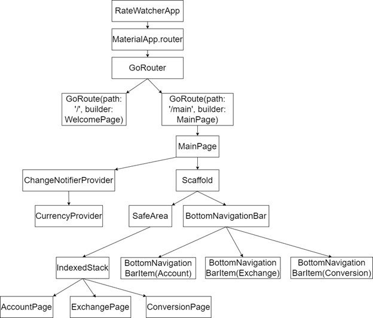
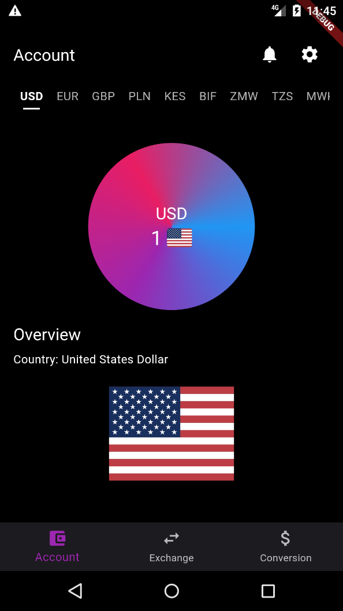
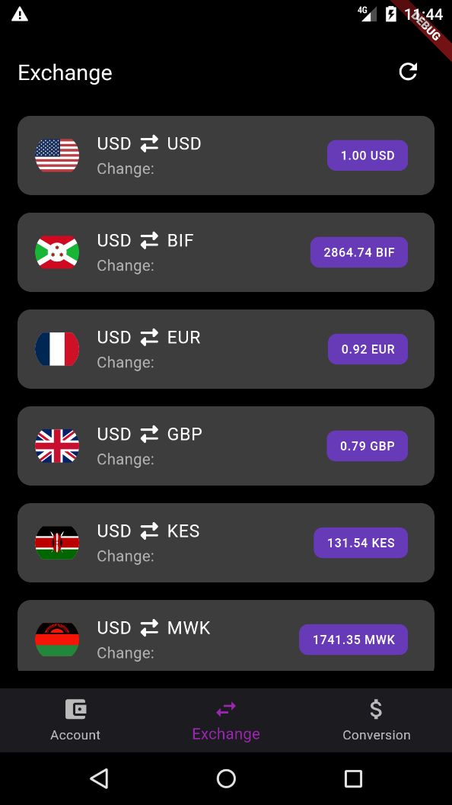
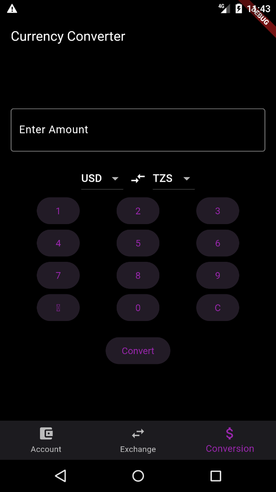

<!-- PROJECT SHIELDS -->
[![Contributors][contributors-shield]][contributors-url]
[![Forks][forks-shield]][forks-url]
[![Stargazers][stars-shield]][stars-url]
[![Issues][issues-shield]][issues-url]
[![MIT License][license-shield]][license-url]
[![LinkedIn][linkedin-shield]][linkedin-url]

<!-- PROJECT LOGO -->
 

  <a href="https://github.com/slymackjr/rate-watcher">
    
    <h3 align="center">Rate Watcher</h3>
  </a>

  <h3 align="center">Flutter Currency Exchange Rate App</h3>

  

    Rate Watcher is a Flutter application that provides users with real-time exchange rate information and a simple currency converter. The app features a bottom navigation bar for easy navigation between different sections, including account page, exchange rate viewing, and currency conversion.
     
    <a href="https://github.com/slymackjr/rate-watcher"><strong>Explore the docs »</strong></a>
     
     
    <a href="https://github.com/slymackjr/rate-watcher/issues">Report Bug</a>
    ·
    <a href="https://github.com/slymackjr/rate-watcher/issues">Request Feature</a>
  

<!-- TABLE OF CONTENTS -->

  
Table of Contents

  <ol>
    <li>
      <a href="#introduction">Introduction</a>
    </li>
    <li>
      <a href="#design-and-implementation">Design and Implementation</a>
      <ul>
        <li><a href="#widget-tree">Widget Tree</a></li>
        <li><a href="#ui-design">UI Design</a></li>
        <li><a href="#state-management">State Management</a></li>
        <li><a href="#api-integration">API Integration</a></li>
        <li><a href="#refresh-logic">Refresh Logic</a></li>
        <li><a href="#error-handling">Error Handling</a></li>
        <li><a href="#enhancements">Enhancements</a></li>
      </ul>
    </li>
    <li>
      <a href="#conclusion">Conclusion</a>
    </li>
    <li><a href="#contact">Contact</a></li>
    <li><a href="#acknowledgments">Acknowledgments</a></li>
  </ol>

<!-- INTRODUCTION -->
## Introduction

### Overview
Rate Watcher is a Flutter application that provides users with real-time exchange rate information and a simple currency converter. The app features a bottom navigation bar for easy navigation between different sections, including account page, exchange rate viewing, and currency conversion. Exchange rates are fetched from an online API and displayed with country flags and decorated rates.

### Features
- **Account Page:** Displays selected currency details and origin.
- **Exchange Rates:** Shows current exchange rates for various currencies.
- **Currency Conversion:** Converts amounts between different currencies.
- **Refresh Rates:** Updates exchange rates with the latest API data.
- **Persistent Bottom Navigation:** Allows seamless navigation between app sections.

### Key Components
- **State Management:** Utilizes `Provider` for managing currency selection.
- **Networking:** Fetches exchange rates from an external API.
- **UI Design:** Custom widgets for displaying rates, numeric conversion, and handling state changes.

<!-- DESIGN AND IMPLEMENTATION -->
## Design and Implementation

### Widget Tree
The widget tree of the Rate Watcher app is structured as follows:

### UI Design

#### Welcome Page
The Welcome Page introduces the app features through rotating slides with titles, descriptions, and feature-related images.

#### Main Page
The Main Page serves as the primary navigation hub with a bottom navigation bar for switching between Account, Exchange, and Conversion pages.

#### Account Page
Displays selected currency details, including flag and country name, with horizontal currency selection.

#### Exchange Rate Page
Shows real-time exchange rates with country flags and a refresh button to update rates.

#### Conversion Page
Enables currency conversion with numeric input, dropdown menus for base and target currencies, and a conversion button.

### State Management
The app uses `Provider` for centralized state management of currency data and user interactions.

### API Integration
Integration with external APIs fetches real-time exchange rates and supported currency codes.

### Refresh Logic
The refresh button on the Exchange Page updates exchange rates by fetching the latest data from the API.

### Error Handling
Robust error handling ensures smooth app functionality with informative messages for data fetching and user input errors.

### Enhancements
Recent improvements include enhanced UI with country flags and decorated exchange rate displays, along with a refresh button for real-time updates.

<!-- CONCLUSION -->
## Conclusion

Rate Watcher provides a user-friendly interface for managing currency exchange rates and conversions. With its well-structured design, effective state management, and seamless API integration, the app ensures a smooth and informative user experience. Recent enhancements have further improved UI appeal and real-time data updates, making Rate Watcher a robust choice for currency monitoring.

<!-- CONTACT -->
## Contact

Jofrey Nyamasheki - [LinkedIn](https://www.linkedin.com/in/jofrey-nyamasheki-9bb8781ab)

Project Link: [https://github.com/slymackjr/rate-watcher](https://github.com/slymackjr/rate-watcher)

<!-- ACKNOWLEDGMENTS -->
## Acknowledgments

- [Choose an Open Source License](https://choosealicense.com)
- [GitHub Emoji Cheat Sheet](https://www.webpagefx.com/tools/emoji-cheat-sheet)
- [Img Shields](https://shields.io)
- [GitHub Pages](https://pages.github.com)
- [Font Awesome](https://fontawesome.com)

<!-- MARKDOWN LINKS & IMAGES -->
<!-- https://www.markdownguide.org/basic-syntax/#reference-style-links -->
[contributors-shield]: https://img.shields.io/github/contributors/slymackjr/rate-watcher.svg?style=for-the-badge&color=4EA94B
[contributors-url]: https://github.com/slymackjr/rate-watcher/graphs/contributors
[forks-shield]: https://img.shields.io/github/forks/slymackjr/rate-watcher.svg?style=for-the-badge
[forks-url]: https://github.com/slymackjr/rate-watcher/network/members
[stars-shield]: https://img.shields.io/github/stars/slymackjr/rate-watcher.svg?style=for-the-badge
[stars-url]: https://github.com/slymackjr/rate-watcher/stargazers
[issues-shield]: https://img.shields.io/github/issues/slymackjr/rate-watcher.svg?style=for-the-badge
[issues-url]: https://github.com/slymackjr/rate-watcher/issues
[license-shield]: https://img.shields.io/github/license/slymackjr/rate-watcher.svg?style=for-the-badge
[license-url]: https://github.com/slymackjr/rate-watcher/blob/master/LICENSE.txt
[linkedin-shield]: https://img.shields.io/badge/-LinkedIn-black.svg?style=for-the-badge&logo=linkedin&colorB=555
[linkedin-url]: https://www.linkedin.com/in/jofrey-nyamasheki-9bb8781ab?utm_source=share&utm_campaign=share_via&utm_content=profile&utm_medium=android_app
